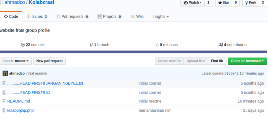

# TutorialGitKonflik
Untuk dapat terjadinya konflik pada sebuah project di git dibutuhkan minimal 3 orang yaitu sebagai upstream dan dua orang sebagai kontributor.

### Kontributor pertama dan kedua melakukan fork repo milik upstream

